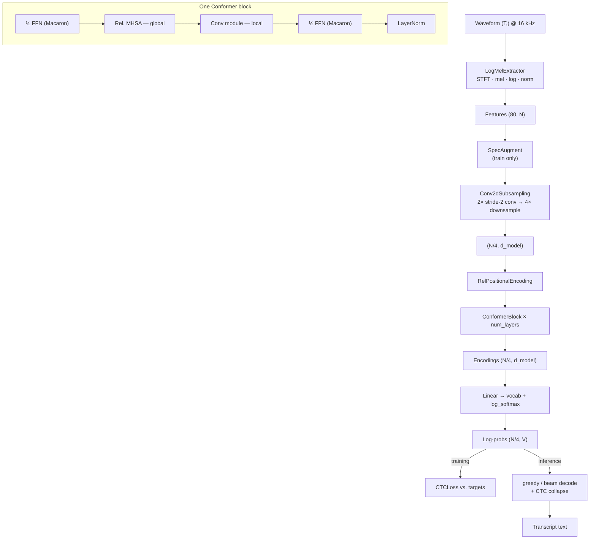

# MedASR — Architecture Reference

A quick-reference companion to [`concepts.md`](concepts.md): the data-flow
diagram, tensor shapes, and where each component lives in the code.

## Data flow

## Tensor shapes (defaults)

| Stage | Shape | Notes |
|-------|-------|-------|
| Waveform | `(T,)` | 16 kHz mono |
| Log-mel features | `(80, N)` | `N ≈ samples / 160` frames (100/s) |
| After subsampling | `(N/4, 256)` | 4× time reduction, `d_model=256` |
| Encoder output | `(N/4, 256)` | 16 Conformer blocks |
| Log-probs | `(N/4, V)` | `V` = tokenizer vocab size |

## Component map

| Concept | File | Key class / fn |
|---------|------|----------------|
| Config schema | `medasr/config.py` | `Config` |
| Feature extraction | `medasr/data/features.py` | `LogMelExtractor` |
| Augmentation | `medasr/data/augment.py` | `SpecAugment` |
| Dataset / batching | `medasr/data/dataset.py` | `ASRDataset`, `collate_batch` |
| Text normalisation | `medasr/text.py` | `normalize` |
| Tokenizer | `medasr/tokenizer.py` | `CharTokenizer`, `BPETokenizer` |
| Subsampling | `medasr/models/subsampling.py` | `Conv2dSubsampling` |
| Feed-forward | `medasr/models/feedforward.py` | `FeedForwardModule`, `Swish` |
| Self-attention | `medasr/models/attention.py` | `RelPositionMultiHeadAttention` |
| Conv module | `medasr/models/convolution.py` | `ConformerConvModule` |
| Encoder | `medasr/models/encoder.py` | `ConformerBlock`, `ConformerEncoder` |
| CTC model | `medasr/models/ctc.py` | `ConformerCTC` |
| Decoding | `medasr/decoding.py` | `greedy_decode`, `beam_search_decode` |
| Metrics | `medasr/metrics.py` | `wer`, `cer` |
| Training | `medasr/training.py` | `Trainer`, `NoamWarmup` |
| Inference | `medasr/inference.py` | `Transcriber` |
| Serving | `app/api.py` | FastAPI `/transcribe` |

## Model size

With the default config (`d_model=256`, `num_layers=16`, `num_heads=4`), the
encoder is roughly **30 M parameters** — a "Conformer-S/M" scale suitable for a
single GPU. Scale `d_model` and `num_layers` up for larger corpora.
